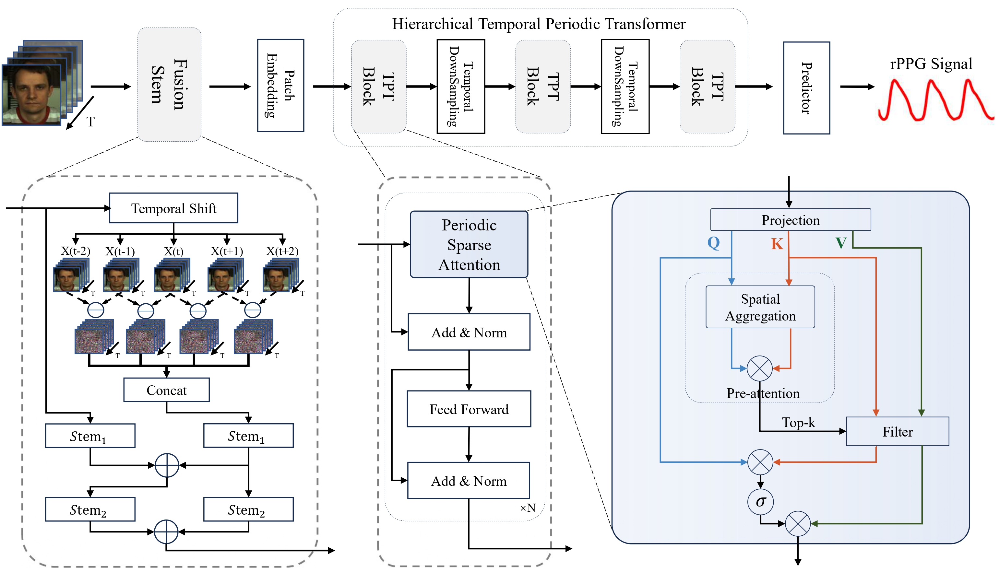

# RhythmFormer
The codes are based on [rPPG-toolbox](https://github.com/ubicomplab/rPPG-Toolbox)

## :wrench: Setup

STEP 1: `bash setup.sh` 

STEP 2: `conda activate rppg-toolbox` 

STEP 3: `pip install -r ./requirements.txt` 

## :computer: Example of Using Pre-trained Models 

Please use config files under `./configs/infer_configs`

For example, if you want to run The model trained on UBFC-rPPG and tested on MMPD, use `python main.py --config_file ./configs/infer_configs/UBFC-rPPG_MMPD_RHYTHMFORMER.yaml`

## :computer: Examples of Neural Network Training

Please use config files under `./configs/train_configs`

### Intra-dataset on MMPD With RhythmFormer

STEP 1: Download the MMPD raw data by asking the paper authors

STEP 2: Modify `./configs/train_configs/intra/0MMPD_RHYTHMFORMER.yaml` 

STEP 3: Run `python main.py --config_file ./configs/train_configs/intra/0MMPD_RHYTHMFORMER.yaml` 

### Cross-dataset - Training on PURE and testing on UBFC-rPPG With RhythmFormer

STEP 1: Download the PURE raw data by asking the [paper authors](https://www.tu-ilmenau.de/universitaet/fakultaeten/fakultaet-informatik-und-automatisierung/profil/institute-und-fachgebiete/institut-fuer-technische-informatik-und-ingenieurinformatik/fachgebiet-neuroinformatik-und-kognitive-robotik/data-sets-code/pulse-rate-detection-dataset-pure).

STEP 2: Download the UBFC-rPPG raw data via [link](https://sites.google.com/view/ybenezeth/ubfcrppg)

STEP 3: Modify `./configs/train_configs/cross/23PURE_UBFC-rPPG_RHYTHMFORMER.yaml` 

STEP 4: Run `python main.py --config_file ./configs/train_configs/cross/23PURE_UBFC-rPPG_RHYTHMFORMER.yaml` 

